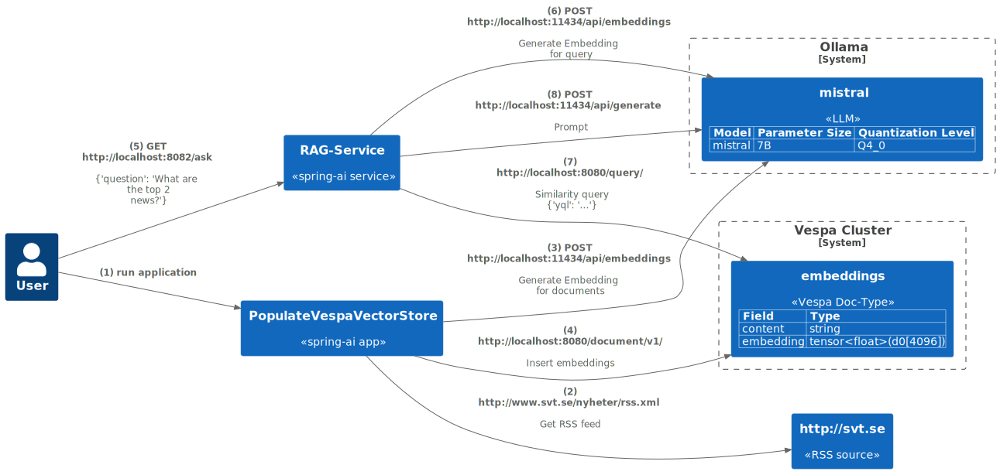

# spring-ai-vespa-embedding-sample

This repo is the result of me experimenting with running LLM models 
[spring-ai](https://docs.spring.io/spring-ai/reference/), 
[ollama](https://ollama.ai/) and [vespa](https://vespa.ai/). 
I wanted to run everything locally and not rely on any online services. 

This is a simple RAG Spring AI application running everything locally 
that uses Vespa as the VectorStore and an ollama model 
for building embeddings and prompting.

The repo has two (spring-boot) applications:

- [PopulateVespaVectorStore](src/main/java/com/pehrs/spring/ai/etl/PopulateVespaVectorStore.java) - 
Batch job that will get a number of news articles via RSS feeds and insert them into Vespa for 
the RAG calling the ollama to generate the embedding vector.
- [RagSampleService](src/main/java/com/pehrs/spring/ai/service/RagSampleService.java) - Service that will use Vespa to do a similarity search 
to provide set of documents for the PromptTemplate. The service uses this [template](src/main/resources/rag-prompt-template.st).




This code is built on-top of these samples:
- https://github.com/habuma/spring-ai-rag-example
- https://github.com/chenkunyun/spring-boot-assembly/tree/master


Remember that spring-ai is still in development. 
Please check out these for updates:

- https://docs.spring.io/spring-ai/reference/
- https://github.com/spring-projects/spring-ai
- https://repo.spring.io/ui/native/snapshot/org/springframework/ai/spring-ai/

## Build

```shell
# if you use asdf then set jdk version to 17+
asdf local java corretto-17.0.6.10.1

# Results go into target/spring-ai-vespa-embedding-sample-0.0.1-SNAPSHOT-assembly/
mvn clean package
```

## Runtime Requirements

### Ollama model running locally

Install [ollama](https://ollama.ai/download) 

The [default configuration](src/main/resources/vespa.yaml) is using the [mistral llm](https://ollama.ai/library/mistral):
```shell
ollama pull mistral:latest
```

To list your local ollama models:
```shell
ollama list

# For more details on the models do:
curl -s localhost:11434/api/tags | jq .
```

### Vespa

#### Start Vespa cluster

You need to start a Vespa version 8 cluster:

```shell
docker run --detach \
  --name vespa \
  --hostname vespa-tutorial \
  --publish 8080:8080 \
  --publish 19071:19071 \
  --publish 19092:19092 \
  --publish 19050:19050 \
  vespaengine/vespa:8
```

Note: the 19050 port is not absolutely necessary, but has a nice 
[status page](http://localhost:19050/clustercontroller-status/v1/llm) for the Vespa cluster once you have your Vespa doc-types in place.

#### Deploy application
Install the vespa-cli if needed:
```shell
brew install vespa-cli
```

Run from the root of this repo:
```shell
vespa deploy --wait 300 vespa
```
If you used the above docker command to expose the 19050 
port then you can monitor the Cluster status on this page:
http://127.0.0.1:19050/clustercontroller-status/v1/llm


#### Stopping Vespa 

To kill (and delete all data from) the Vespa cluster just:
```shell
docker rm -f vespa
```


## Usage

The examples below are using bash scripts to start the 
applications as the "normal" way of building a spring-boot application, 
with the `spring-boot-maven-plugin` plugin, does not allow you 
to have multiple applications. 
So I'm using the `maven-assembly-plugin` to build a distribution with start scripts.

NOTE: The scripts have only been tested on Linux (Ubuntu 22.04) so your mileage might vary. 
You can always start the applications in Intellij, if you use that.

### Populate Vespa with your favorite news

```shell
./target/spring-ai-vespa-embedding-sample-0.0.1-SNAPSHOT-assembly/bin/populate-vespa-cluster.sh \
   http://www.svt.se/nyheter/rss.xml
```

### Start the RAG-Service

```shell
./target/spring-ai-vespa-embedding-sample-0.0.1-SNAPSHOT-assembly/bin/rag-service.sh
```

Once the service is up and running then you can ask a question:

```shell
curl localhost:8082/ask \
  -H "Content-type: application/json" \
  -d '{"question": "What are the top 5 news?"}'
```

## Configuration

### Vespa 

If you need to change the vespa config please make sure that your 
[vespa.yaml](src/main/resources/vespa.yaml) config aligns 
with the [vespa schema](vespa/schemas/embeddings.sd) deployed

### Ollama

If you need to change the ollama config please make sure 
your [application.properties](src/main/resources/application.properties) 
align with your downloaded model (`ollama list`)

## Misc

The image above is created using [PlantUML](https://plantuml.com/command-line) 
from the [spring-ai-vespa-embedding-sample.puml](spring-ai-vespa-embedding-sample.puml) file. 
